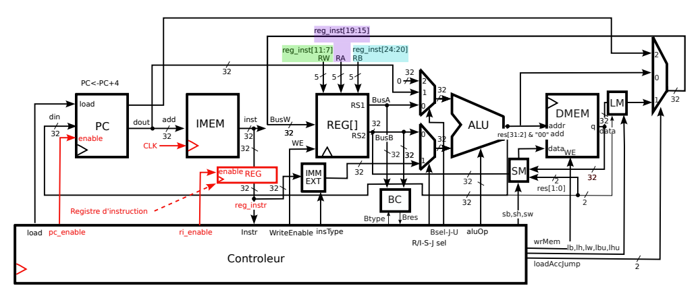
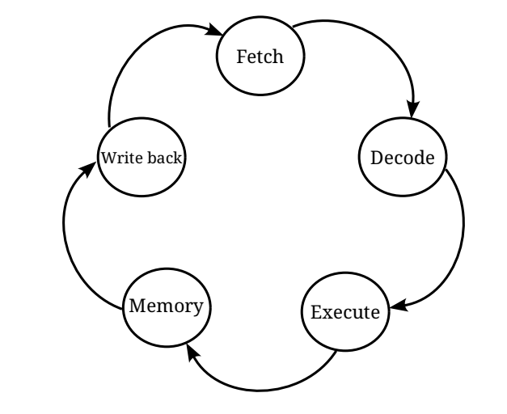

# 5-Cycle RISC-V Processor (VHDL)

## Overview
This project is a VHDL implementation of a **32-bit RISC-V Processor** based on a **multi-cycle architecture**. The processor executes instructions over five distinct stages (Fetch, Decode, Execute, Memory, Writeback), controlled by a finite state machine (FSM). It supports a significant portion of the **RV32I** (Base Integer) instruction set, including arithmetic, logical, memory access, branching, and jump instructions.

## Key Features
* **Architecture:** Multi-cycle (5-stage) Datapath.
* **Instruction Set:** RV32I subset (Integer, Load/Store, Branch, Jump, U-Type).
* **Memory Model:** Separate Instruction Memory (`imem`) and Data Memory (`dmem`) interfaces.
* **Control Unit:** FSM-based control (`ir_dec_risb`) managing state transitions and control signals.
* **Simulation:** Includes a testbench (`RISCV_RISB_tb`) and support for loading programs via Hex files.

* 

## Project Structure

### Top Level
* **`RISCV_RISB.vhd`**: The top-level entity connecting the Datapath and Control Unit. It instantiates the PC, Memories, ALU, Register Bank, and Decoder.
* **`constants.vhd`**: Defines global constants, including RISC-V opcodes (R-Type, I-Type, S-Type, B-Type, etc.) and ALU operation codes.

### Control Unit
* **`ir_dec_risb.vhd`**: The main controller. It contains the 5-state FSM (`FETCH`, `DECODE`, `EXECUTE`, `MEMORY`, `WRITEBACK`) and generates control signals for the datapath based on the instruction opcode and current state.
* **`bc.vhd`** (Branch Controller): Evaluates branch conditions (BEQ, BNE, BLT, BGE, etc.) and outputs a signal to update the PC if the branch is taken.

### Datapath Components
* **`alu.vhd`**: Arithmetic Logic Unit. Performs operations such as ADD, SUB, SLL, SLT, XOR, SRL, SRA, OR, AND.
* **`regbank.vhd`**: A 32x32-bit Register Bank with asynchronous read and synchronous write. Register x0 is hardwired to 0.
* **`compteur.vhd`**: The Program Counter (PC). Handles normal incrementing (+4) and jump/branch loading.
* **`registre_instr.vhd`**: Instruction Register (IR). Holds the fetched instruction stable during the Decode, Execute, Memory, and Writeback cycles.
* **`imm_ext.vhd`**: Immediate Extender. Generates 32-bit sign-extended immediates from instruction bits based on the instruction type (I, S, B, J, U).
* **`mux_*.vhd`**: Various multiplexers for routing data (e.g., `mux_opa` for ALU input A, `mux_wb` for Writeback selection).

### Memory Interface
* **`imem.vhd`**: Instruction Memory. Read-only memory initialized from a text file (default: `prog_jump.hex`).
* **`dmem.vhd`**: Data Memory. Single-port RAM for load/store operations.
* **`lm.vhd`** (Load Module): Handles data alignment and sign-extension for byte (`LB`), half-word (`LH`), and word loads.
* **`sm.vhd`** (Store Module): Handles data alignment for byte (`SB`), half-word (`SH`), and word stores.

### Simulation
* **`RISCV_RISB_tb.vhd`**: Testbench for the top-level entity. Generates the clock and reset signals to simulate the processor's execution.

## Supported Instructions (RV32I Subset)
Based on the decoder (`ir_dec_risb.vhd`) and ALU (`alu.vhd`), the processor supports:
* **R-Type**: `ADD`, `SUB`, `SLL`, `SLT`, `SLTU`, `XOR`, `SRL`, `SRA`, `OR`, `AND`
* **I-Type**: `ADDI`, `SLTI`, `SLTIU`, `XORI`, `ORI`, `ANDI`, `SLLI`, `SRLI`, `SRAI`, `JALR`, `LB`, `LH`, `LW`, `LBU`, `LHU`
* **S-Type**: `SB`, `SH`, `SW`
* **B-Type**: `BEQ`, `BNE`, `BLT`, `BGE`, `BLTU`, `BGEU`
* **U-Type**: `LUI`, `AUIPC`
* **J-Type**: `JAL`

## How to Simulate
1.  **Prerequisites**: A VHDL simulator (e.g., ModelSim, GHDL, Vivado, or Quartus).
2.  **Program Loading**:
    * Create a file named  `sim.hex.txt` (as referenced in the testbench) containing the machine code of your RISC-V program in hexadecimal format (8 characters per line).
    * Place this file in the simulation directory.
3.  **Compilation**:
    * Compile `constants.vhd` first.
    * Compile all other component files (`alu.vhd`, `regbank.vhd`, etc.).
    * Compile the top-level `RISCV_RISB.vhd`.
    * Compile the testbench `RISCV_RISB_tb.vhd`.
4.  **Running**:
    * Load `RISCV_RISB_tb` into your simulator.
    * Run the simulation. The clock period is set to 10 ns in the testbench.
    * Observe signals `pc`, `instr`, `result`, and `regBank32` (inside `rb_1`) to verify execution.

## Finite State Machine (FSM)
The processor operates in 5 cycles per instruction:
1.  **FETCH**: Fetch instruction from `imem`, increment PC (if not jumping).
2.  **DECODE**: Decode instruction, read registers.
3.  **EXECUTE**: Perform ALU operation or calculate effective address.
4.  **MEMORY**: Access `dmem` for Load/Store instructions.
5.  **WRITEBACK**: Write result back to `regbank`.

